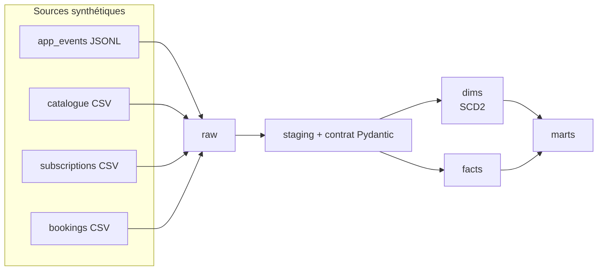

# KaraSing — plateforme data (projet portfolio fictif)

> ⚠️ **Projet 100% fictif à but pédagogique.** "KaraSing" n'est pas une entreprise réelle,
> n'a aucun lien avec KaraFun ou toute autre marque existante. Toutes les données
> (utilisateurs, chansons, artistes, bars, réservations, abonnements) sont synthétiques,
> générées par [`generator/`](generator/). Aucun vrai titre, vrai artiste ou vraie donnée
> n'est utilisé.

## Contexte

Ce projet simule la reprise d'une plateforme data construite par un prestataire externe
pour un éditeur fictif d'application de karaoké (app grand public + 3 bars karaoké à
Lille, Paris, Bruxelles). Objectif : **auditer l'existant, le fiabiliser progressivement
et le faire évoluer avec SQLMesh**, sur le modèle d'une mission réelle de Data Engineer
senior — construit pour maîtriser concrètement SQLMesh, les contrats de données et les
audits, sans les avoir pratiqués en production. Voir [Ce que ce projet prouve / ne prouve
pas](#ce-que-ce-projet-prouve--ne-prouve-pas).

## Statut

- ✅ Jalon 1 — Setup (repo, environnement Python, générateur de données)
- ✅ Jalon 2 — Audit du pipeline legacy
- ✅ Jalon 3 — SQLMesh init (staging, contrats de données, quarantaine, comparaison legacy)
- ✅ Jalon 4 — Modélisation (dims SCD2, faits incrémentaux, marts)
- ✅ Jalon 5 — Qualité (tests unitaires, audits, détection d'anomalie de volume)
- ✅ Jalon 6 — Exercice d'incident (injection, détection, restatement, post-mortem)
- ✅ Jalon 7 — CI GitHub Actions
- ⬜ Jalon 8 — Option cloud (BigQuery sandbox / Pulumi) — optionnel, non fait, architecture cible documentée dans [`docs/architecture_cible.md`](docs/architecture_cible.md)
- 🚧 Jalon 9 — Livrables finaux (README, ADRs, pitch, questions d'entretien) — en cours

## Architecture

**Chemin principal (implémenté, 0€, sans carte bancaire)** : Python + SQLMesh + DuckDB en
local, CI GitHub Actions gratuite sur repo public.



Détail complet des couches, du rôle de chaque brique et de l'architecture cible cloud
(Docker → Cloud Run → BigQuery → Looker) : [`docs/architecture_cible.md`](docs/architecture_cible.md).

## Décisions clés

| Décision | Pourquoi | Détail |
|---|---|---|
| DuckDB en local plutôt que BigQuery d'emblée | 0€, sans carte, itération rapide | — |
| Contrat Pydantic + quarantaine sur `app_events` | Détecter les breaking changes backend sans casser le pipeline | [`jalon3_recap.md`](docs/jalon3_recap.md) |
| `SCD_TYPE_2_BY_TIME` (dim_user) vs `SCD_TYPE_2_BY_COLUMN` (dim_song/artist) | Deux patterns de source différents (log de changements vs snapshots) | [`jalon4_recap.md`](docs/jalon4_recap.md) |
| Audits non-bloquants pour la cohérence référentielle et le volume | Ne pas arrêter tout un run pour un problème localisé à un intervalle | [`jalon5_recap.md`](docs/jalon5_recap.md) |
| Pas de bot CI/CD officiel SQLMesh | Pensé pour une prod partagée entre PRs, hors scope ici | [`jalon7_recap.md`](docs/jalon7_recap.md) |

## Comment lancer le projet

```bash
pip install -r requirements.txt
```

```bash
python -m generator --days 30 --seed 42
```

```bash
sqlmesh plan
```

Pour explorer les résultats : `sqlmesh fetchdf "SELECT * FROM marts.top_songs_by_country_day LIMIT 10"`.

Pour comparer avec le pipeline prestataire d'origine : `python legacy/run_all.py`, puis
voir [`docs/audit_legacy.md`](docs/audit_legacy.md) pour l'analyse des défauts qu'il contient.

## Structure

```
generator/       générateur de données synthétiques (events app, catalogue, abonnements, bookings)
legacy/           pipeline "prestataire" d'origine, repris tel quel pour audit
models/
  raw/            exposition brute des sources
  staging/        nettoyage, typage, corrections (TZ, dédup...)
  contracts/      contrats de données Pydantic + modèles Python (validation + quarantaine)
  dim/            dimensions, dont 3 en SCD Type 2
  facts/          faits incrémentaux
  marts/          agrégats métier (top chansons, redevances, KPI abonnements, occupation bars)
audits/           audits SQLMesh custom (cohérence référentielle, anomalie de volume)
tests/            tests unitaires SQLMesh
.github/workflows/ CI GitHub Actions (lint, tests, plan sur DuckDB frais)
docs/             audit legacy, recaps par jalon, architecture cible, runbook d'incident
data/raw/         sorties du générateur (non versionné, régénérable)
```

## Limites connues

- `marts.subscription_kpis_monthly` ne calcule pas encore un vrai taux de churn (actifs
  en début de période vs résiliés pendant la période) — actifs/résiliés bruts seulement.
- Historique SCD2 reconstruit uniquement **à partir du premier `sqlmesh plan`** : les
  transitions passées qu'on connaissait déjà (avant la mise en place du dim) ne sont pas
  datées précisément (`valid_from` = sentinel epoch) — limitation du fonctionnement natif
  de `SCD_TYPE_2` (voir [`jalon4_recap.md`](docs/jalon4_recap.md)).
- Framework de test unitaire SQLMesh peu adapté à la validation fine des modèles `SCD_TYPE_2`
  (colonnes `valid_from`/`valid_to`) — vérifié manuellement à la place.
- `marts.venue_occupancy_daily` peut dépasser 100% (le générateur ne prévient pas les
  doubles réservations salle/créneau) — capacité approximative, pas de détection de
  chevauchement au niveau créneau.
- Option cloud (jalon 8, Pulumi/BigQuery) non implémentée à ce stade.

## Ce que ce projet prouve / ne prouve pas

**Prouve** : capacité à auditer un pipeline existant et prioriser dette vs risque ; à
construire un projet SQLMesh complet (staging, contrats de données versionnés avec
quarantaine, dimensions SCD2, faits incrémentaux, marts) ; à instrumenter la qualité
(audits bloquants/non-bloquants, détection d'anomalie de volume, tests unitaires) ; à
gérer un incident de bout en bout (détection → diagnostic → restatement ciblé →
post-mortem) ; à mettre en place une CI qui valide réellement le projet depuis zéro (et à
déboguer les problèmes que ça révèle — dépendances cachées, portabilité Windows/Linux).

**Ne prouve pas** : usage de SQLMesh en production, à l'échelle, sur des volumes réels ;
expérience opérationnelle du support/monitoring d'un pipeline SQLMesh en conditions
réelles (alerting, astreinte) ; déploiement cloud réel (jalon 8 optionnel, non fait).

## Documentation complémentaire

- [`docs/audit_legacy.md`](docs/audit_legacy.md) — audit du pipeline prestataire (jalon 2)
- [`docs/jalon3_recap.md`](docs/jalon3_recap.md) à [`jalon7_recap.md`](docs/jalon7_recap.md) — récaps techniques par jalon
- [`docs/architecture_cible.md`](docs/architecture_cible.md) — architecture cloud cible
- [`docs/runbook_incident.md`](docs/runbook_incident.md) — post-mortem de l'exercice d'incident (jalon 6)
