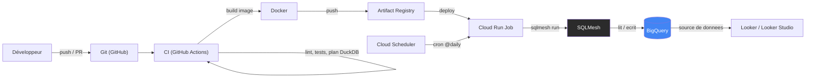
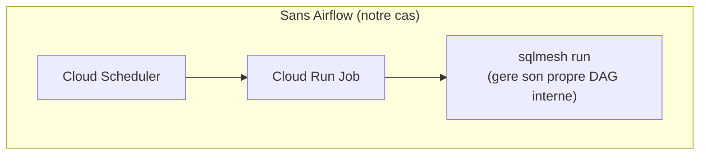
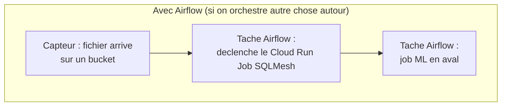

# Architecture cible — KaraSing en production

> Ce document décrit l'architecture **cible** (comment le projet tournerait en vraie
> production sur GCP), par opposition au chemin principal actuel du projet qui tourne
> 100% en local sur DuckDB (0€, sans carte bancaire). Voir `README.md` pour ce qui est
> réellement implémenté vs documenté ici à titre d'architecture cible.

## Vue d'ensemble



## Le tableau des rôles

| Brique | Rôle | Équivalent chez Orange (déjà connu) | Testé dans ce projet |
|---|---|---|---|
| **Git / GitHub** | Source de vérité du code, déclenche la CI | GitLab | ✅ Jalon 1-7 |
| **GitHub Actions** | Lint, tests, validation du plan SQLMesh à chaque PR | GitLab CI/CD | ✅ Jalon 7 |
| **Docker** | Package le projet (Python + SQLMesh + dépendances) en image reproductible | Docker sur Cloud Run | ⬜ Non testé (chemin cloud optionnel) |
| **Artifact Registry** | Stocke les images Docker versionnées | — | ⬜ |
| **Cloud Run Job** | Exécute `sqlmesh run` à la demande, dans un conteneur éphémère (pas un service qui tourne en continu) | Cloud Run (tes pipelines actuels) | ⬜ |
| **Cloud Scheduler** | Déclenche le Cloud Run Job selon un cron | Cloud Composer / Airflow | ⬜ |
| **SQLMesh** | Transforme les données, gère son propre graphe de dépendances et son propre ordonnancement interne | — (nouveau) | ✅ Jalons 3-7 (sur DuckDB) |
| **BigQuery** | Entrepôt de données cible en production | BigQuery (ta migration Teradata) | ⬜ Option jalon 8 |
| **Looker / Looker Studio** | Couche de restitution (dashboards), lecture seule sur BigQuery | — | ⬜ Hors périmètre |

## La question qui compte : où est Airflow ?

**Nulle part dans le schéma ci-dessus — et c'est volontaire.**



SQLMesh a son **propre ordonnanceur** : chaque modèle déclare un `cron` (`@daily`, etc.), et
`sqlmesh run` calcule tout seul quels intervalles doivent être recalculés, dans quel ordre
(son graphe de dépendances entre modèles — `raw` → `staging` → `dims`/`facts` → `marts`).
Pas besoin d'un DAG Airflow pour ça.



Airflow redevient pertinent seulement si SQLMesh n'est **qu'une étape parmi d'autres** dans
un flux plus large et hétérogène (attendre un fichier, enchaîner un job ML, coordonner
plusieurs systèmes qui n'ont rien à voir avec la transformation SQL). Dans ce cas, le DAG
Airflow aurait une seule tâche significative : "déclenche le Cloud Run Job SQLMesh" — Airflow
orchestre au niveau **macro** (le flux global), SQLMesh orchestre au niveau **micro** (le
graphe de dépendances entre ses propres modèles).

## Exemple concret : passer de DuckDB à BigQuery

Le code SQLMesh (les fichiers `.sql`/`.py` dans `models/`) **ne change presque pas**. Seul le
`config.yaml` change de gateway :

```yaml
# Aujourd'hui (local, 0€)
gateways:
  duckdb:
    connection:
      type: duckdb
      database: db.db
default_gateway: duckdb
```

```yaml
# Cible (BigQuery)
gateways:
  bigquery:
    connection:
      type: bigquery
      project: karasing-prod
      # authentification via service account (voir garde-fous ci-dessous)
default_gateway: bigquery
```

Le dialecte (`model_defaults.dialect`) passerait de `duckdb` à `bigquery` — SQLMesh
retraduit les macros/fonctions automatiquement pour le moteur cible (`sqlglot` en interne),
mais certaines fonctions spécifiques à DuckDB qu'on a utilisées (`read_csv_auto`,
`read_json_auto`, `AT TIME ZONE` double-appliqué) n'ont pas d'équivalent direct sur
BigQuery — elles seraient à adapter (ingestion via un chargement BigQuery natif plutôt que
lire des fichiers directement, par exemple).

## Exemple concret : un changement de code, de bout en bout

1. Tu modifies `models/facts/fct_song_plays.sql` sur une branche, tu ouvres une PR.
2. **GitHub Actions** lance lint + `sqlmesh test` + `sqlmesh plan` sur DuckDB éphémère (jalon 7).
3. PR mergée sur `master` → un second workflow (à ajouter) build l'image **Docker**, la pousse
   sur **Artifact Registry**, met à jour le **Cloud Run Job**.
4. Le lendemain, **Cloud Scheduler** déclenche le Job comme d'habitude — il tourne avec le
   nouveau code, `sqlmesh run` détecte le changement et backfille ce qui doit l'être
   (exactement le mécanisme `plan`/`run` qu'on a pratiqué tout le jalon 3-7, juste exécuté
   dans le cloud au lieu d'un terminal local).
5. **Looker** lit les nouvelles données dans **BigQuery**, aucun changement de son côté.

## Garde-fous obligatoires avant tout déploiement réel (jalon 8)

- Alerte de budget à **1€** configurée avant toute ressource créée.
- Vérification des limites du **free tier** au moment du déploiement (ça évolue).
- Service account à **moindre privilège** (accès BigQuery + Cloud Run uniquement, pas de rôle
  Owner/Editor projet).
- `pulumi destroy` **systématique** en fin de session — aucune ressource qui traîne entre deux
  sessions de travail.

## Ce que ce document prouve / ne prouve pas

✅ Compréhension de l'architecture cible et des rôles de chaque brique, capacité à expliquer
les choix (notamment pourquoi Airflow n'est pas nécessaire pour SQLMesh seul).

❌ Ce document ne remplace pas un déploiement réel — le chemin cloud (Docker → Cloud Run →
BigQuery) reste **optionnel et non implémenté** à ce stade, réservé au jalon 8 si le temps
le permet, avec les garde-fous ci-dessus.
